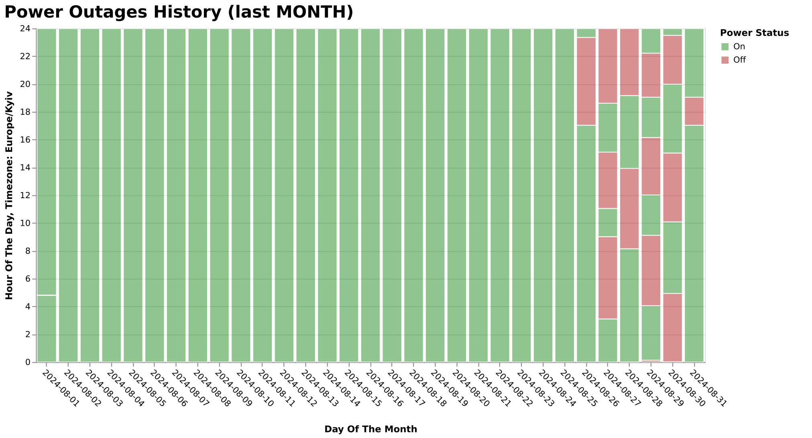
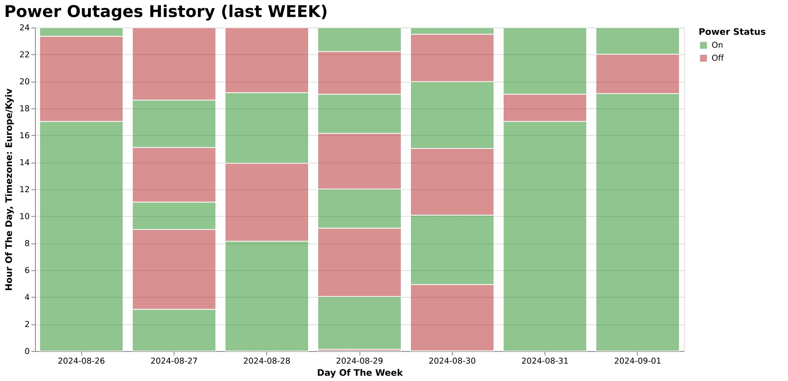
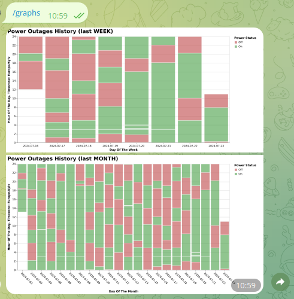

This is a telegram bot for monitoring and collecting statistics of power outages.  
It collects information by pinging home router.  
Allows to collect and visualise statistics, forecast future `reinstatement`/`outages`.  
Provides ability to set up notifications about it in different ways.

* Most features are available without database connection.

# Basic Features:

## Tracking power `outages` or `reinstatement`:

- By personal message, in channel, in group;
- Pinned status message in a group with un-pinning previous and clearing action message;
- Prediction of future `outages` or `reinstatement` based on previous week with immediate notification `(database required)`.

## Statistics and information:
- Ability to draw an outage graph for the previous week or month at any time `(database required)`;
- Regular sending of graphs to the channel `(database required)`;
- Internal logging with the ability to retrieve any level of internal logs at any time.
  

## Available Commands

- **/graphs**: Retrieve graphs for the last week and month.
- **/graph_week**: Retrieve the graph for the last week.
- **/graph_month**: Retrieve the graph for the last month.
- **/status**: Check the current status of the service.
- **/me**: Get user and chat information, as well as service health details.

- **/trace**: Retrieve TRACE level internal logs.
- **/debug**: Retrieve DEBUG level internal logs.
- **/info**: Retrieve INFO level internal logs.
- **/warn**: Retrieve WARN level internal logs.
- **/error**: Retrieve ERROR level internal logs.
- **/logs**: Retrieve logs of ALL levels (TRACE, DEBUG, INFO, WARN, ERROR).